# Learning Today: What Are Students Telling Us?

This repository contains the full code, data processing workflows, and results of the project  
**“Learning Today. What Are Students Telling Us?”**  
focused on the analysis of academic performance in Barcelona and Catalonia under different socioeconomic, institutional, and educational conditions.

The project is based exclusively on **open public datasets** from the Generalitat de Catalunya, IDESCAT, and Open Data Barcelona.

---

##  Research Team

- Ana Cano Herranz (anacanoherranz)
- Julia Carrillo Alonso (juliaacarrillo)
- Ander Gabarrús Ordóñez (underDD)
- Quintín Huertas Murcia (donquintin)
- Anna Szymanski Cortés (annaszymanskicortes)

Contact: `andergabarrus.val@gmail.com`

---

##  Research Objectives

This project investigates:

- The **evolution of academic performance** in Barcelona and Catalonia.
- The **relationship between socioeconomic context and school success**.
- The **impact of school ownership (public vs private)** on academic outcomes.
- The **effect of special and specific educational need** on students’ performance.
- The **post-compulsory educational trajectories** of students after 4th ESO.
- The **impact of COVID-19 on academic progression**.
- Students’ growing **detachment from traditional academic paths**.

---

##  Data Sources

All datasets are publicly available and fully anonymized:

- ESO academic results (2013–2023)
- Basic competencies test results (4º ESO)
- Territorial Socioeconomic Index (IST)
- Rent per capita by census section
- Population census data
- Educational trajectories (ESO → Bachillerato / FP)
- University enrollments
- NESE (special educational needs)
- Barcelona district geometries (JSON)

Formats include **CSV, XLSX and JSON**.

---

##  Repository Structure

```text
├── data/ # Shared general datasets (raw)
├── data_Ana/ # Datasets used specifically by Ana
├── data_Ander/ # Datasets used specifically by Ander
├── data_Anna/ # Datasets used specifically by Anna
├── data_Julia/ # Datasets used specifically by Julia
├── data_Quintin/ # Datasets used specifically by Quintín
│
├── figures_ana/ # Figures generated by Ana
├── figures_julia/ # Figures generated by Julia
├── figures_quintin/ # Figures generated by Quintín
│
├── notebook_ana.ipynb # Ana’s analysis notebook
├── notebook_ander.ipynb # Ander’s analysis notebook
├── notebook_anna.ipynb # Anna’s analysis notebook
├── notebook_julia.ipynb # Julia’s analysis notebook
├── notebook_quintin.ipynb # Quintín’s analysis notebook
│
├── OpenData.ipynb # General notebook for dataset exploration
│
├── LICENSE # License information
├── .gitignore # Git ignore rules
├── README.md # Project documentation (this file)
└── notas.txt # Scratch notes (not part of final analysis)
```
## 📊 Results and Figures

This section presents the main visual results of the project.  
Each research line includes a placeholder for inserting the figures generated by each team member.  
All images should be stored inside their corresponding `figures_<name>` folders.

---

### 📈 Ander Gabarrús — Time Evolution of Academic Performance

Focus:
- Evolution of promotion rates (pass, pass with pending subjects, fail)
- Temporal evolution of basic competencies
- Relationship with socioeconomic indicators (IST, rent per capita, suitability index)

**Figures:**

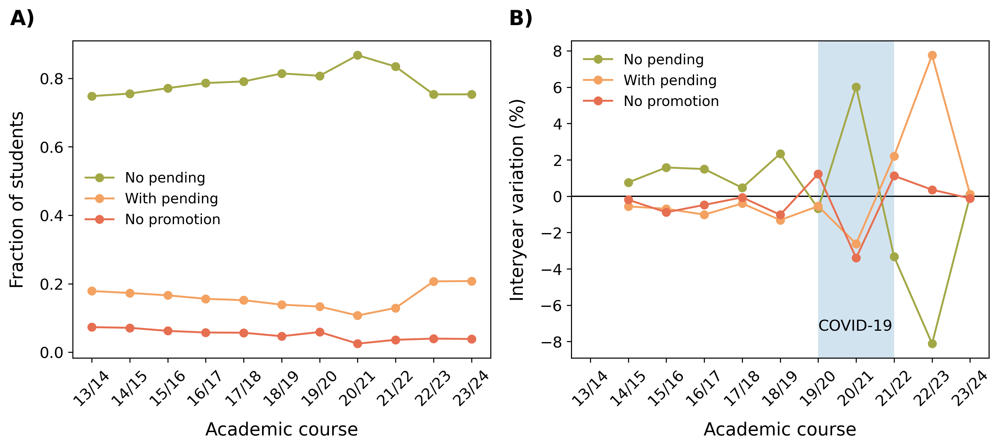
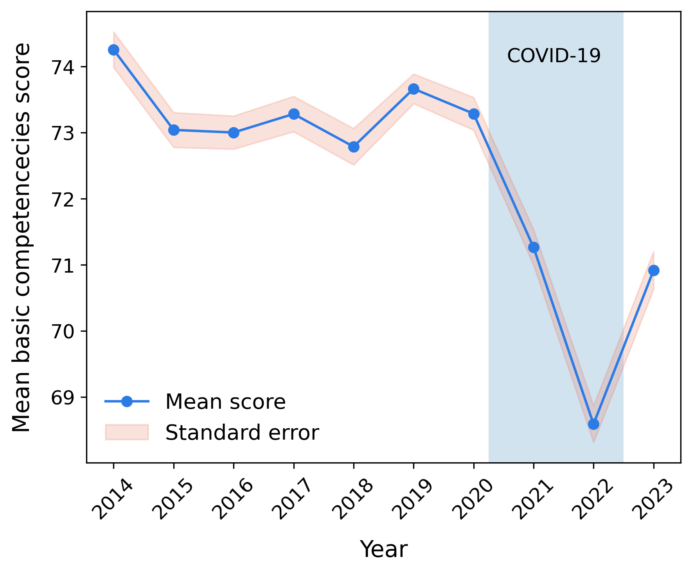
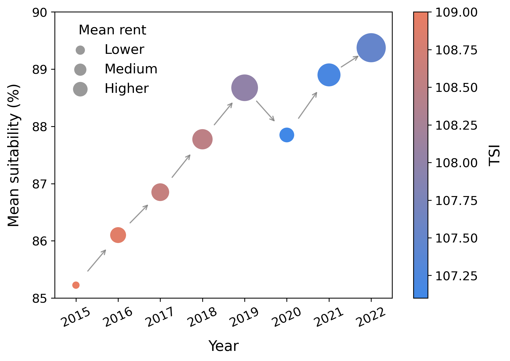

🏘️ Ana Cano — Socioeconomic Context vs Academic Results
Focus:

Academic Promotion Index

Relationship between promotion and territorial socioeconomic index (IST) by district

Correlation and regression analysis

District-level spatial maps

Figures:

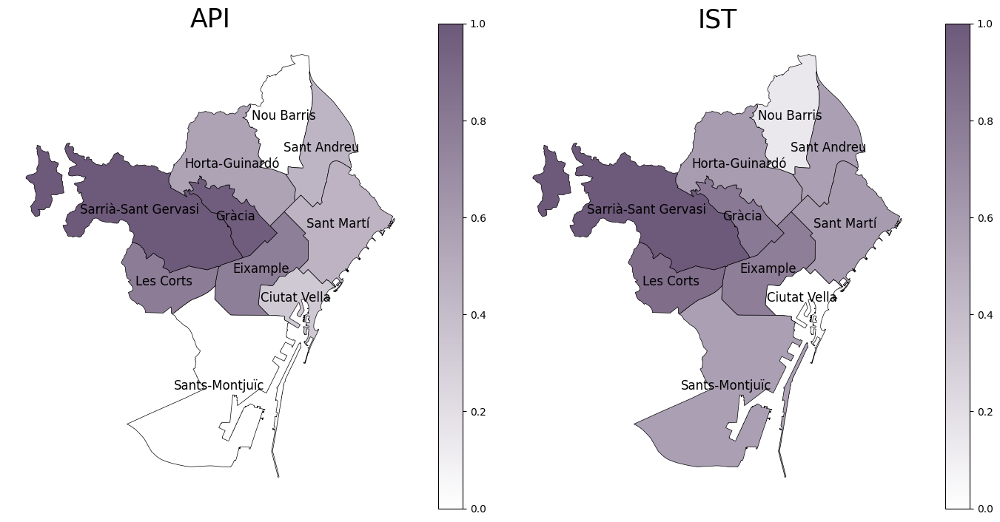
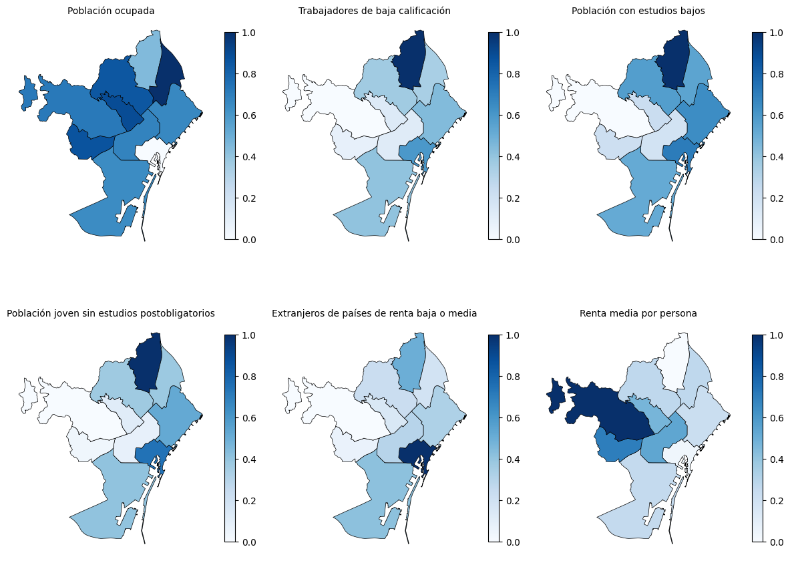
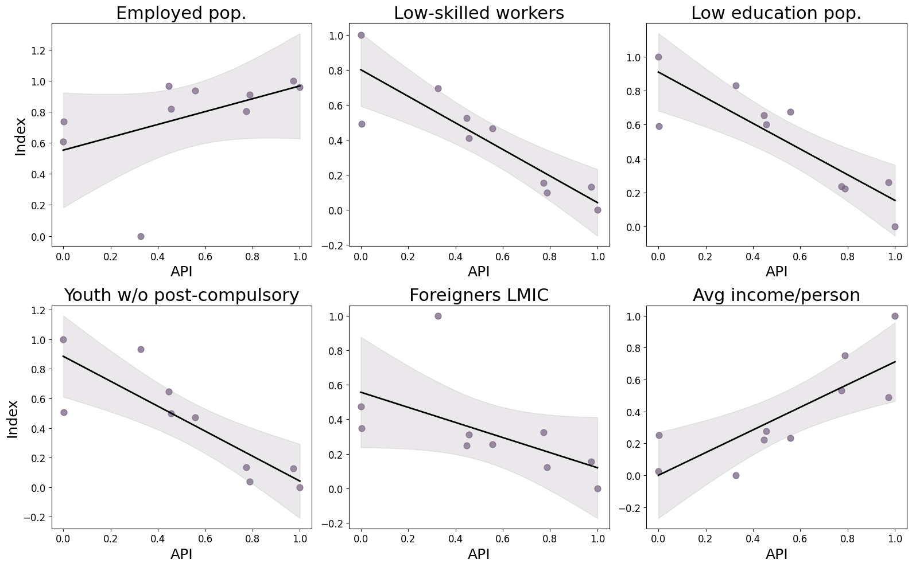
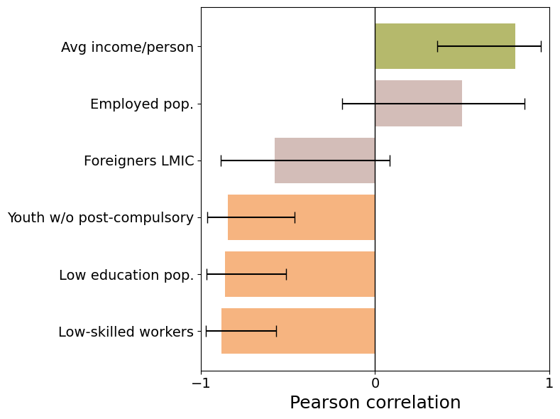


🏫 Anna Szymanski — Public vs Private School Inequalities
Focus:

Comparison between public, private and state-subsidized schools

Basic competencies by school type

District-based visualization of academic inequalities

Figures:


🧩 Julia Carrillo — Educational Needs (NESE) & Performance
Focus:

Distribution of special and specific educational needs

Gender-based analysis

Correlation between NESE prevalence and promotion

District-based geospatial analysis

Figures:

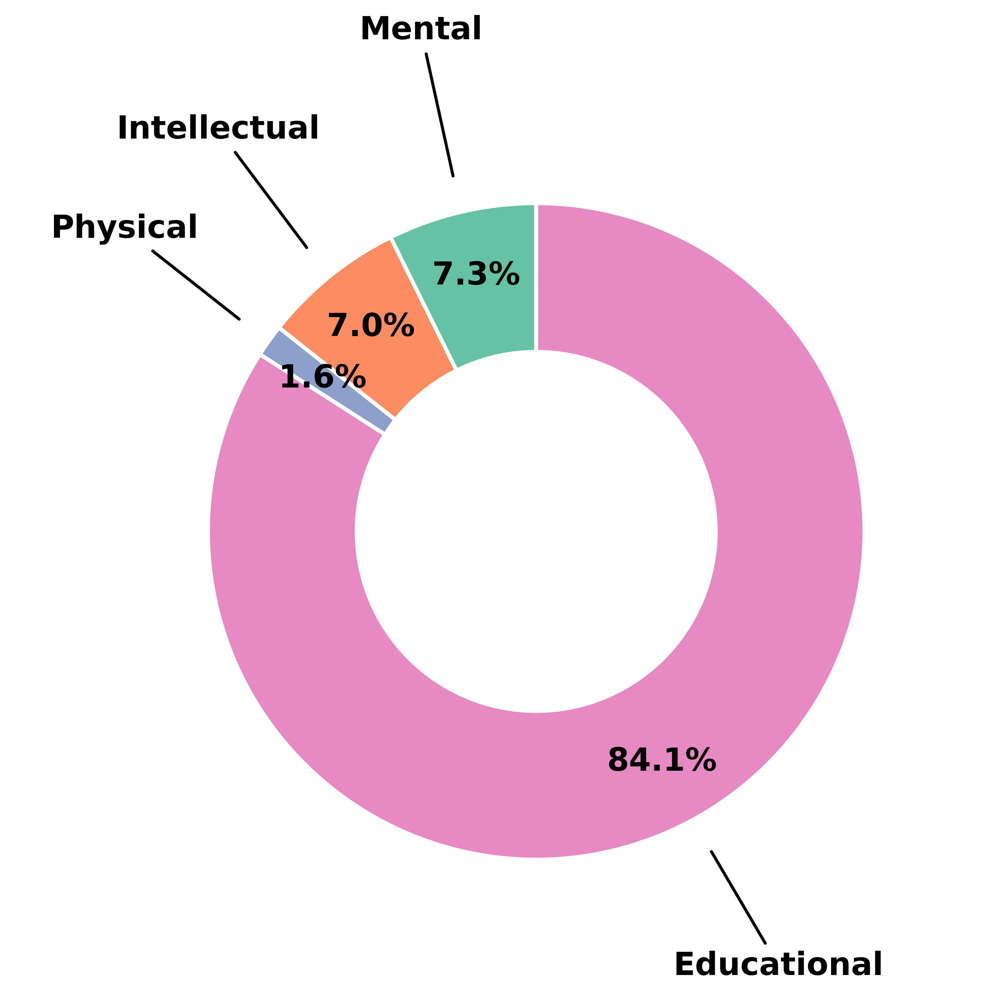
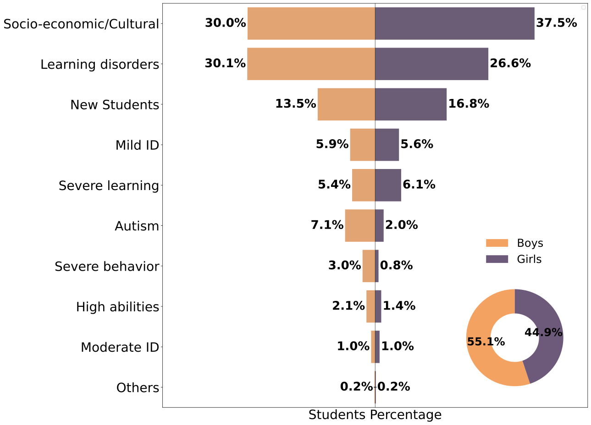
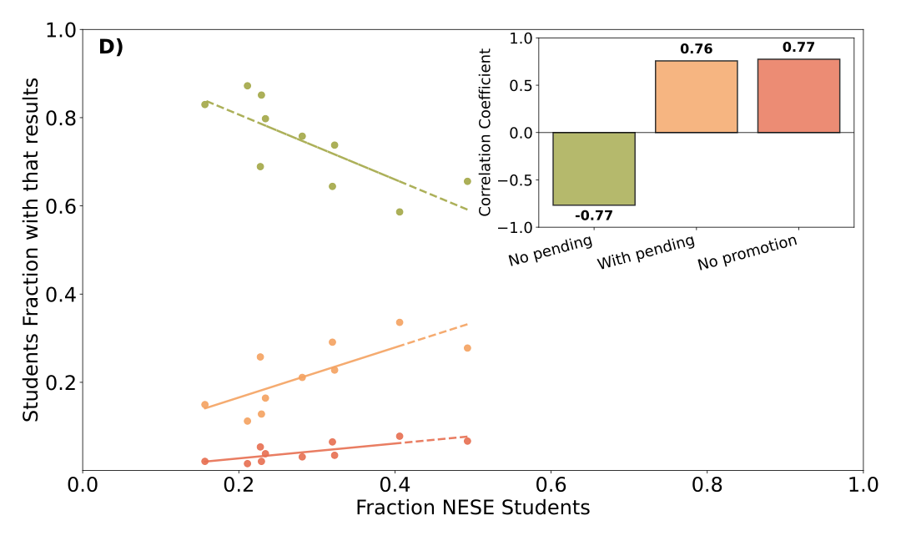
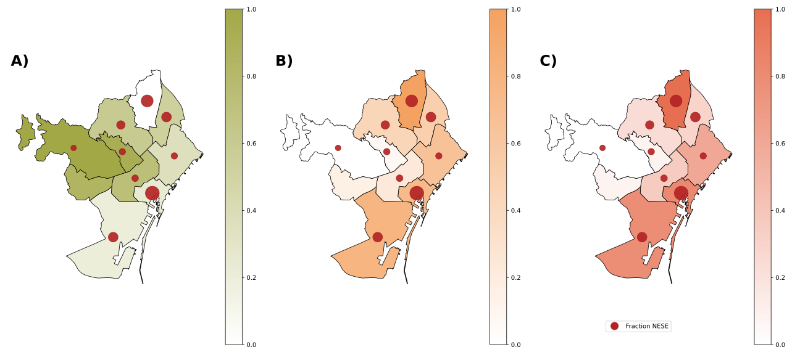

🔄 Quintín Huertas — Educational Trajectories & Student Flows
Focus:

Transitions from ESO to Bachillerato and FP

Time evolution of post-compulsory education

University enrollments

Relationship with district income

Figures:

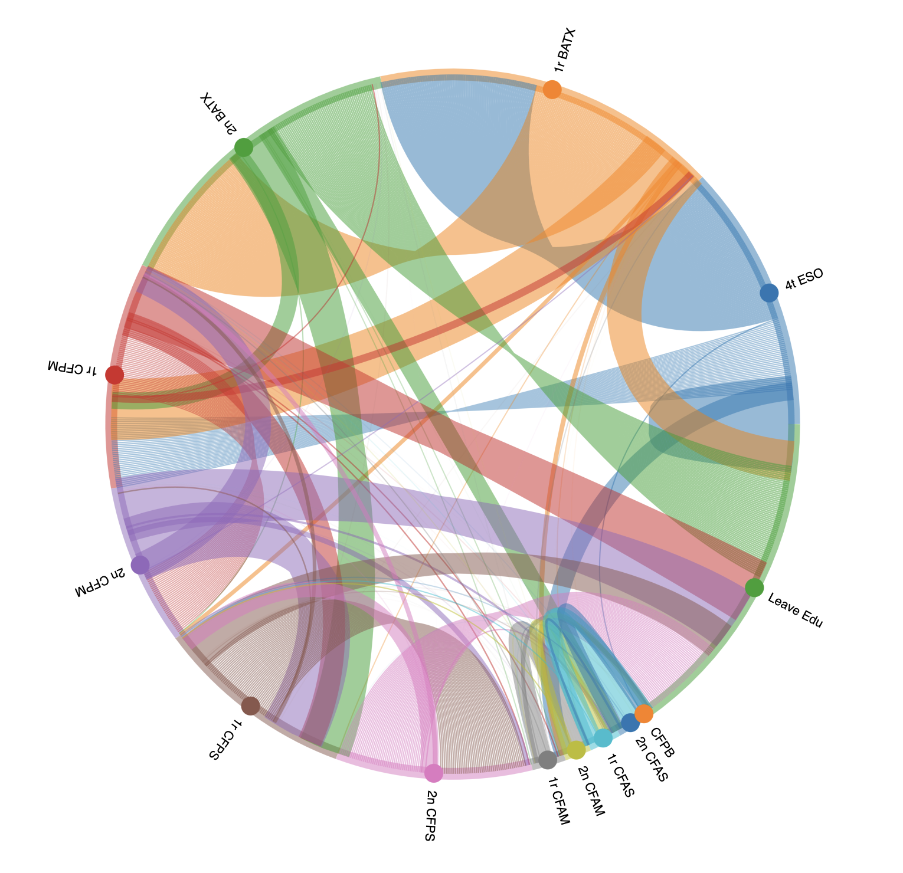
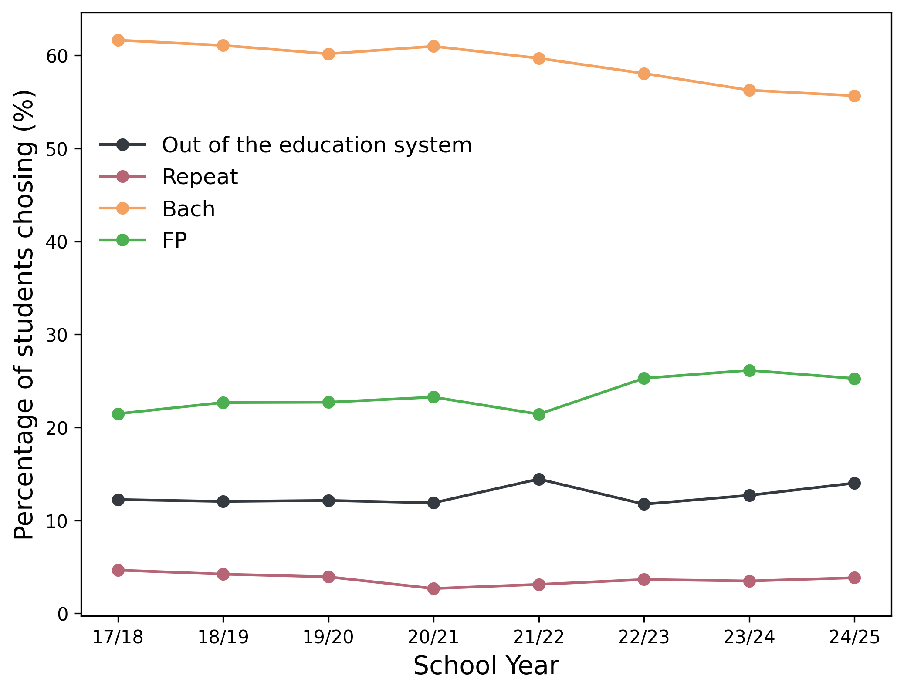


